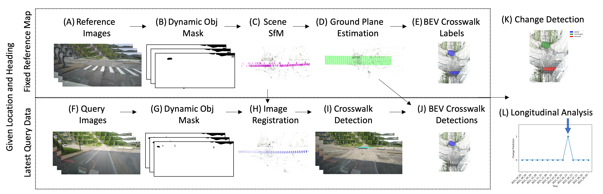

# Toward Map Updates with Crosswalk Change Detection Using a Monocular Bus Camera
Tom Bu, Christoph Mertz, John Dolan
Proceedings of IEEE Intelligent Vehicles Symposium (IV'23)


 * [Project Page](https://tom-bu.github.io/busview_crosswalk_cd)
 * [Data](https://www.kaggle.com/datasets/buvision/buscrosswalkchange)


## Demo
The method is outlined as in the figure 
<p align="center">
  
</p>

## Setup
Download the crosswalk detection model [here](). 
The repository uses detectron2. 

### Reference Map Creation
The dataset already contains the offline map. But if you would like to recreate the map, you can run it as below. The default setting uses crosswalk 3D points to fit a plane because some intersections have non-planar road surfaces, and this is to control the location the plane is fitted to. The intersection structure-from-motion only performs sparse reconstruction, but dense reconstruction can be performed for better visualization.
```
python3 offline_mapping.py 
```
### Query Time Change Detection
The change detection code for analyzing query images can be run as below
```
python3 offline_mapping_query.py 
```

### Dataset
The dataset is saved here  [Data](https://www.kaggle.com/datasets/buvision/buscrosswalkchange) where it can be downloaded. This is only the offline dataset and it covers one year of images recorded by the bus at these intersections. The structure is as follows. The images and masks under ${intersection_id} are reference images used to make the reference map. The sparse directory under ${intersection_id} is the reference sfm map. The plane segmentation directory reorients the scene so that z points up and the ground has an elevation of 0. Images and masks under the query folder are query images and used to detect if a change has occurred. 

    dataset
        └── ${intersection_id}
            ├── sparse
            │   ├── db.db
            │   ├── images.txt
            │   ├── points3D.txt
            │   ├── project.ini
            │   ├── cameras.txt
            │   └── plane_segmentation
            │       ├── images.txt
            │       ├── points3D.txt
            │       ├── cameras.txt       
            │       ├── hand_label.pkl       
            │       └── label.pkl       
            ├── images
            │   └── camera3   
            │       └── ${image_id}.jpg 
            ├── mask
            │   └── camera3  
            │       └── ${image_id}.jpg.png 
            └── query
                └── ${date_id}  
                    ├── images
                    │   └── query   
                    │       └── ${query_image_id}.jpg 
                    └── mask
                        └── query  
                            └── ${query_image_id}.jpg.png 


## Citing
If you find our work useful, please consider citing:
```BibTeX
@conference{Bu-2023,
author = {Tom Bu and Christoph Mertz and John Dolan},
title = {Toward Map Updates with Crosswalk Change Detection Using a Monocular Bus Camera},
booktitle = {Proceedings of IEEE Intelligent Vehicles Symposium (IV '23)},
year = {2023},
month = {June},
publisher = {IEEE},
}
```