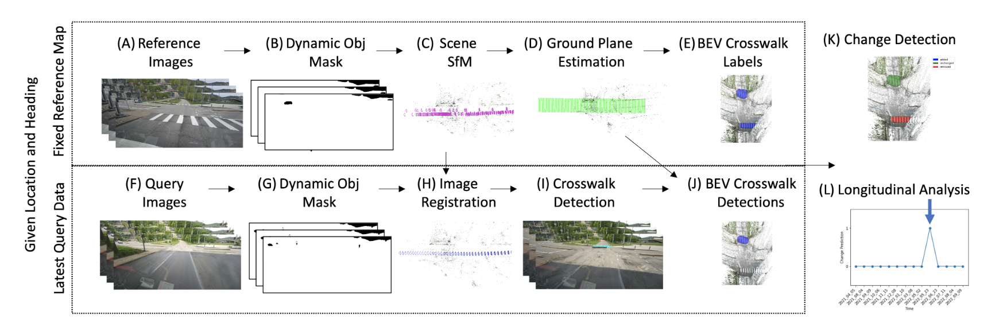

# Toward Map Updates with Crosswalk Change Detection Using a Monocular Bus Camera
Tom Bu, Christoph Mertz, John Dolan
Proceedings of IEEE Intelligent Vehicles Symposium (IV'23)


 * [Project Page](https://tom-bu.github.io/BusCamCrosswalkCD/)
 * [Data](https://www.kaggle.com/datasets/buvision/buscrosswalkchange)


## Demo
The method is outlined as in the figure 
<p align="center">
  
</p>

## Setup
```
conda create -n cw_cd python=3.8.8
conda activate cw_cd
pip install -r requirements.txt
```

Install [pytorch](https://pytorch.org/get-started/locally/)

Install [detectron2](https://github.com/facebookresearch/detectron2/blob/main/README.md)

Install [colmap](https://colmap.github.io/) from source in order to utilize GPUs or without GPUs by 

```
sudo apt update
sudo apt install colmap
``` 


### Dataset
The dataset is saved [here](https://www.kaggle.com/datasets/buvision/buscrosswalkchange) where it can be downloaded. This is only the offline dataset and it covers one year of images recorded by the bus at these intersections. The structure is as follows. The images and masks under ${intersection_id} are reference images used to make the reference map. The sparse directory under ${intersection_id} is the reference sfm map. The plane segmentation directory is the same sparse sfm map but reorients the scene so that z points up and the ground has an elevation of 0. However, the point correspondence information is lost in the plane_segmentation files, which is why the original sfm is kept. Images and masks under the query folder are query images and used to detect if a change has occurred. ${date_id} is a recording from a single time and date. 

To test it, one can download one intersection, e.g. cw_0_267, which represents intersection 0 at angle 267 degrees.

Download the pre-trained crosswalk detection model [here](model/crosswalk_detector/model_final.pth). The file from git clone might produce a place holder. Go to the link to download the actual model and place it in the `model/crosswalk_detector/`


    dataset
        └── ${intersection_id}
            ├── sparse
            │   ├── db.db
            │   ├── images.txt
            │   ├── points3D.txt
            │   ├── project.ini
            │   ├── cameras.txt
            │   └── plane_segmentation
            │       ├── images.txt
            │       ├── points3D.txt
            │       ├── cameras.txt       
            │       ├── hand_label.pkl       
            │       └── label.pkl       
            ├── images
            │   └── camera3   
            │       └── ${image_id}.jpg 
            ├── mask
            │   └── camera3  
            │       └── ${image_id}.jpg.png 
            └── query
                └── ${date_id}  
                    ├── images
                    │   └── query   
                    │       └── ${query_image_id}.jpg 
                    └── mask
                        └── query  
                            └── ${query_image_id}.jpg.png 


### Reference Map Creation
The dataset already contains the offline map. But if you would like to recreate the map, you can run it as below. The default setting uses crosswalk 3D points to fit a plane because some intersections have non-planar road surfaces, and this is to control the location the plane is fitted to. The intersection structure-from-motion only performs sparse reconstruction, but dense reconstruction can be performed for better visualization.
```
python3 offline_mapping.py 
```
### Query Time Change Detection
The change detection code for analyzing query images can be run as below. The current script will run all intersections and dates, which will take a some time (30 intersections * 12 dates * approx 5min/intersection). You can comment out some of the intersections in `intersection_li` and remove some of the dates in the dataset. The current script only runs the best configuration, but you can uncomment out the other experiments from the paper in the `experiment_li` variable.
```
python3 offline_mapping_query.py 
```

This will generate another sfm output for each query ${date_id}


    dataset
        └── ${intersection_id}
            └── query
                └── ${date_id}  
                    ├── images
                    │   └── query   
                    │       └── ${query_image_id}.jpg 
                    ├── mask
                    │   └── query  
                    │       └── ${query_image_id}.jpg.png 
                    └── sparse
                        ├── images
                        │   └── ${image_id}.jpg 
                        ├── base_sensor_obs_loc
                        │   ├── change.pkl       
                        │   ├── change_debug.jpg 
                        │   ├── label.pkl 
                        │   ├── reference.jpg 
                        │   └── change_pred.jpg 
                        ├── localized_imgs.pkl
                        ├── localization_query.jpg
                        ├── localization_query_det.jpg
                        ├── db.db
                        ├── images.txt
                        ├── points3D.txt
                        └── cameras.txt


This will generate an image like 
<p align="center">
  
</p>
and print out a summary table of the detection results, where the top table shows the metrics for changes at the crosswalk level and the bottom shows the metrics at the intersection level. 

```
\begin{tabular}{llllllrrlr}
\toprule
   ref & obs & loc & empty & precision & recall &  accuracy &  fpr &   f1 &  no\_c precision \\
\midrule
sensor &   x &   x &       &      None &   None &       1.0 &  0.0 & None &             1.0 \\
\bottomrule
\end{tabular}


\begin{tabular}{llllllrrlr}
\toprule
   ref & obs & loc & empty & precision & recall &  accuracy &  fpr &   f1 &  no\_c precision \\
\midrule
sensor &   x &   x &       &      None &   None &       1.0 &  0.0 & None &             1.0 \\
\bottomrule
\end{tabular}


```

## Citing
If you find our work useful, please consider citing:
```BibTeX
@conference{Bu-2023,
author = {Tom Bu and Christoph Mertz and John Dolan},
title = {Toward Map Updates with Crosswalk Change Detection Using a Monocular Bus Camera},
booktitle = {Proceedings of IEEE Intelligent Vehicles Symposium (IV '23)},
year = {2023},
month = {June},
publisher = {IEEE},
}
```